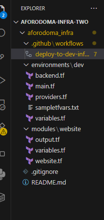
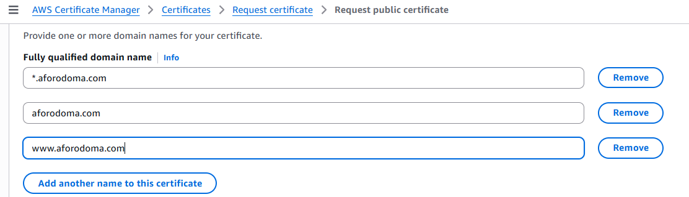

# My edits

## started with this set up



## Manually created an ACM cert in us-east-1



https://docs.aws.amazon.com/acm/latest/userguide/acm-public-certificates.html#:~:text=To%20request%20an%20ACM%20public,section%2C%20type%20your%20domain%20name.
next time try to provision it using terraform on a separate block.

✅ Next Steps to Complete Validation:

1. Check Validation Type
   You likely chose DNS validation or Email validation.

🔹 If you chose DNS Validation:
You need to add a CNAME record to your domain's DNS settings.

Go to the AWS Certificate Manager (ACM) console.

Click on the certificate ID: 2aefa5f6-6696-4785-8f08-7448b50ab345.

In the Validation tab, you'll see the required CNAME record (Name and Value).

Add this record in your domain provider's DNS (e.g., Namecheap, Route 53, etc.).

Wait for a few minutes to a few hours. AWS will auto-validate.

🔹 If you chose Email Validation:
ACM will send an email to the WHOIS contact addresses and/or common admin emails (e.g., admin@yourdomain.com).

You must click the approval link in the email to complete validation.

✅ After Validation:
Once validated, ACM will automatically update the certificate status to "Issued", and you can then:

Attach it to CloudFront, ELB, or other AWS services.

Confirm HTTPS access on your domain.

## How to update namecheap

When using Namecheap to add a DNS record for validating an AWS Certificate Manager (ACM) certificate, you’ll map the fields like this:

🔑 From AWS Certificate Manager:
You are given:

CNAME Name → e.g., \_abcde1234567890.example.com

CNAME Value → e.g., \_xyz9876543210.acm-validations.aws

🛠️ In Namecheap, enter:
Field in Namecheap What to Enter from AWS
Type CNAME
Host The first part of the CNAME Name (before your domain) — for example, if the CNAME Name is \_abcde1234567890.example.com, enter just \_abcde1234567890
Value The CNAME Value from AWS — e.g., \_xyz9876543210.acm-validations.aws
TTL (if present) You can leave it as default (Automatic) or set it to 30 min

✅ Example:
From AWS:

CNAME Name: \_abcde1234567890.example.com

CNAME Value: \_xyz9876543210.acm-validations.aws

In Namecheap:

Type: CNAME

Host: \_abcde1234567890

Value: \_xyz9876543210.acm-validations.aws

After saving the DNS record, wait a few minutes to a few hours. AWS will automatically detect the validation and issue the certificate.

## When Adding www.aforodoma.com

If ACM gives you:

Name: \_abc123.www.aforodoma.com

Value: \_xyz456.acm-validations.aws

Then in Namecheap:

Type: CNAME

Host: \_abc123.www

Value: \_xyz456.acm-validations.aws

## Tthe minimum files and folders I need to touch or create:

A. modules/website/
You’ll put the reusable code for S3, CloudFront, and ACM here.

Required files:

website.tf → infrastructure logic (S3, CloudFront, ACM)

variables.tf → input variables (e.g., domain name)

output.tf → output values (e.g., CloudFront URL)

B. environments/dev/ (or prod/ if you're deploying to prod)
You’ll call your module from here.

Files to work on:

main.tf → reference the module

variables.tf → define expected variables

backend.tf → set up remote state (optional, but good practice)

provider.tf → configure AWS provider and region

dev.tfvars → actual variable values (you can rename sampletfvars.txt)

C. .github/workflows/workflows-deploy-to-dev-infra.yml
This automates the deployment when you push. You’ll only need to:

Make sure it triggers on push

Make sure it calls the right folder (environments/dev)

### Needed edits on the workflow file

1️⃣ Branch and Path Triggers
yaml

````on:
push:
branches: - dev
paths: - 'environments/dev/**/\*.tf' - 'modules/**/\*.tf' - '.github/workflows/deploy-to-dev.yml'
Replace:```

dev with the branch you’ll push from (e.g., main if you’re not using a dev branch)

Keep the paths only if you want the workflow to run only when Terraform files change. You can simplify to:

yaml

```on:
push:
branches: - main```
2️⃣ Secrets and Variables
In Configure AWS credentials:
yaml

with:
aws-access-key-id: ${{ secrets.AWS_ACCESS_KEY_ID }}
aws-secret-access-key: ${{ secrets.AWS_SECRET_ACCESS_KEY }}
aws-region: us-east-1
Keep the region as us-east-1 (because ACM for CloudFront must be in us-east-1).

Make sure you set AWS_ACCESS_KEY_ID and AWS_SECRET_ACCESS_KEY in GitHub Secrets.

In terraform.tfvars creation:
Remove anything unrelated to your portfolio website:

yaml


- name: Create terraform.tfvars
  working-directory: environments/dev
  run: |
  echo "bucket_name = \"${{ secrets.BUCKET_NAME }}\"" >> terraform.tfvars
    echo "domain_name = \"${{ secrets.DOMAIN_NAME }}\"" >> terraform.tfvars
  Replace with only the variables your module needs (e.g., bucket_name, domain_name).

Set BUCKET_NAME and DOMAIN_NAME in GitHub Secrets.

Remove:

db_password

amplify_oauth_token

anything about sampletfvars.txt (you won’t need it if your variables are simple).

3️⃣ Remove sampletfvars.txt logic
This whole section:

yaml


- name: Set environment variables from sampletfvars.txt
  You can delete it. You’ll pass variables directly from secrets or terraform.tfvars.

4️⃣ Performance check job
This section:

yaml

performance-check:
...
You don’t need it unless you want to stress test your site. Remove it for now.

5️⃣ Slack Notifications
This section:

yaml

notify-slack:
...
You can remove it unless you have a Slack webhook.

6️⃣ Health-check URL
This part inside the performance test:

javascript

const baseUrl = 'https://dev.backend.netikscloud.com';
Replace with your portfolio domain if you decide to keep performance checks, e.g.:

javascript

const baseUrl = 'https://www.yourdomain.com';
7️⃣ Environment Directory
The workflow currently assumes environments/dev. If you only have a single environment, adjust all references:

Change working-directory: environments/dev to:

environments/main (if you rename it)

or just keep environments/dev and deploy directly there.

🧹 CLEANED-UP VERSION FOR YOUR PORTFOLIO
Here’s the simplified workflow:

yaml

```name: "Deploy Portfolio"

on:
push:
branches: - main

jobs:
deploy:
name: "Deploy Portfolio Website"
runs-on: ubuntu-latest
container:
image: hashicorp/terraform:latest

    steps:
      - name: Checkout code
        uses: actions/checkout@v3

      - name: Configure AWS credentials
        uses: aws-actions/configure-aws-credentials@v2
        with:
          aws-access-key-id: ${{ secrets.AWS_ACCESS_KEY_ID }}
          aws-secret-access-key: ${{ secrets.AWS_SECRET_ACCESS_KEY }}
          aws-region: us-east-1

      - name: Create terraform.tfvars
        working-directory: environments/dev
        run: |
          echo "bucket_name = \"${{ secrets.BUCKET_NAME }}\"" >> terraform.tfvars
          echo "domain_name = \"${{ secrets.DOMAIN_NAME }}\"" >> terraform.tfvars

      - name: Terraform Init
        working-directory: environments/dev
        run: terraform init

      - name: Terraform Plan
        working-directory: environments/dev
        run: terraform plan -no-color -input=false -var-file=terraform.tfvars -out=tfplan

      - name: Terraform Apply
        working-directory: environments/dev
        run: terraform apply -auto-approve tfplan
        ```

🔑 WHAT YOU NEED TO SET IN GITHUB SECRETS
AWS_ACCESS_KEY_ID

AWS_SECRET_ACCESS_KEY

BUCKET_NAME → your S3 bucket name

DOMAIN_NAME → your domain name (if using ACM)
````

## Needed edit on Terraform configuration!

✅ 1. S3 Bucket
Your S3 setup is mostly solid. A few tips:

block_public_access is correctly enabled — good.

You use an Origin Access Identity (OAI) — ✅ recommended.

You're generating a bucket policy that grants read access from CloudFront — also ✅.

✅ No major changes needed here.

✅ 2. CloudFront Distribution
This section works, but you're currently using:

hcl
Copy
Edit
viewer_certificate {
cloudfront_default_certificate = true
}
This means you’re using the default \*.cloudfront.net domain.

🔧 What you need instead:
Use ACM to issue a certificate for your custom domain, and use that cert in viewer_certificate.

Update this section:

hcl
Copy
Edit
viewer_certificate {
acm_certificate_arn = var.acm_certificate_arn
ssl_support_method = "sni-only"
}
You must create a variable for this (in variables.tf):

hcl
Copy
Edit
variable "acm_certificate_arn" {
description = "The ARN of the ACM certificate for custom domain"
type = string
}
✅ This lets you bind your aforodoma.com domain and use HTTPS.

✅ 3. Custom Domain (Aliases)
Update aws_cloudfront_distribution with:

hcl
Copy
Edit
aliases = ["www.aforodoma.com", "aforodoma.com"]
Make sure your ACM cert covers both www and apex domains.

✅ 4. ACM Certificate
Because CloudFront only works with ACM certificates in us-east-1, you must:

Manually or programmatically create an ACM cert in us-east-1.

Validate it (via DNS).

Pass the cert ARN via terraform.tfvars.

You can create this cert via:

AWS Console (ACM → Request certificate)

Or using Terraform (in a separate provider block, see below).

✅ 5. Route53 / DNS Setup
Since you bought your domain from Namecheap, and not Route53:

Set up DNS in Namecheap's dashboard

Add a CNAME for www.aforodoma.com → CloudFront domain

Add an A record (ALIAS) for aforodoma.com pointing to CloudFront — but Namecheap doesn’t support ALIAS, so:

🔄 Recommendation:
Use only www.aforodoma.com in CloudFront and redirect root domain to www.

You can:

Set up a redirect bucket for aforodoma.com → www.aforodoma.com

Or just use www everywhere.

✅ 6. Variables to update
variables.tf
Change defaults to fit your project:

hcl
Copy
Edit
variable "bucket_name" {
description = "Name of the S3 bucket"
type = string
default = "aforodoma-site"
}

variable "tags" {
description = "Common resource tags"
type = map(string)
default = {
Environment = "dev"
Project = "portfolio"
}
}
Add this:

hcl
Copy
Edit
variable "acm_certificate_arn" {
description = "The ACM cert ARN for CloudFront"
type = string
}
✅ 7. terraform.tfvars
Create this file or inject these values in your pipeline:

hcl
Copy
Edit
bucket_name = "aforodoma-site"
acm_certificate_arn = "arn:aws:acm:us-east-1:YOUR_ACCOUNT_ID:certificate/abc-123"
environment = "dev"
✅ 8. Optional: ACM Cert via Terraform
You can manage the cert in Terraform like this:

hcl
Copy
Edit
provider "aws" {
alias = "us_east_1"
region = "us-east-1"
}

resource "aws_acm_certificate" "cert" {
provider = aws.us_east_1
domain_name = "www.aforodoma.com"
validation_method = "DNS"
subject_alternative_names = ["aforodoma.com"]

lifecycle {
create_before_destroy = true
}
}
But you'd also need to handle DNS validation, which is tricky if you're not on Route53.

✅ Summary of What to Edit
File What to Edit
viewer_certificate Use acm_certificate_arn instead of default cert
aliases Add ["www.aforodoma.com", "aforodoma.com"]
variables.tf Add acm_certificate_arn, update bucket_name, tags
terraform.tfvars Provide real values for bucket, cert ARN, environment
DNS (Namecheap) Point www.aforodoma.com CNAME to CloudFront domain

# Other Improvement or Attention

1. CORS Origins
   Your CORS rules still reference:

hcl
Copy
Edit
allowed_origins = [
"http://localhost:3000",
"https://netikscloud.com",
"https://assets.netikscloud.com"
]
➡️ Fix: Replace with your domain:

hcl
Copy
Edit
allowed_origins = [
"https://www.aforodoma.com",
"https://aforodoma.com"
]
You can keep "http://localhost:3000" during development but remove any domains you’re no longer using (netikscloud.com).

2. CloudFront Comment and Tagging
   Your aws_cloudfront_origin_access_identity still has an old comment:

h
Copy
Edit
comment = "OAI for netiks frontend S3 bucket"
➡️ Fix: Update to reflect your project:

hcl
Copy
Edit
comment = "OAI for aforodoma.com portfolio S3 bucket"
Likewise, update Project tag if you want more clarity:

hcl
Copy
Edit
Project = "aforodoma" 3. S3 Bucket Policy – Principal
You're allowing this IAM user:

hcl
Copy
Edit
{
Sid = "AllowPresignedOperations"
Effect = "Allow"
Principal = {
AWS = "arn:aws:iam::619813812970:user/shulamite"
}
➡️ Ask yourself:

Do you still need this?

Are you planning to upload directly using this IAM user?

If not, remove it to reduce surface area. If yes, it's fine to keep — just verify the IAM user is active and secure.

4. Make sure ACM is in us-east-1
   Since CloudFront only supports ACM certificates in us-east-1, confirm your certificate ARN is from that region. You can verify this in AWS Console or by checking the ARN prefix:

makefile
Copy
Edit
arn:aws:acm:us-east-1:... 5. Static Site Hosting (optional)
If you're hosting an actual static website (e.g. HTML, JS), you might want to add the website configuration block in your S3 bucket if you're not using CloudFront error pages:

hcl
Copy
Edit
resource "aws_s3_bucket_website_configuration" "main" {
bucket = aws_s3_bucket.main.id

index_document {
suffix = "index.html"
}

error_document {
key = "error.html"
}
}
However, since you're using CloudFront, this is optional and depends on whether CloudFront is handling errors.

✅ Final Thoughts
You’re nearly production-ready. Just make these changes:

Area Action
CORS Update origins to your domain
CloudFront OAI comment Change from "netiks" to "aforodoma"
Tags Optional, but clearer if updated
Bucket Policy Remove IAM user if not needed
ACM Cert ARN Confirm it's from us-east-1
S3 Static Hosting Optional website_configuration block (if not using SPA routing etc.)

If you’ve already set up your Route 53 alias or Namecheap DNS to point to CloudFront, and validated your ACM certificate, then deploying this will serve your static site globally over HTTPS. 🚀

When using Namecheap to add a DNS record for validating an AWS Certificate Manager (ACM) certificate, you’ll map the fields like this:

🔑 From AWS Certificate Manager:
You are given:

CNAME Name → e.g., \_abcde1234567890.example.com

CNAME Value → e.g., \_xyz9876543210.acm-validations.aws

🛠️ In Namecheap, enter:
Field in Namecheap What to Enter from AWS
Type CNAME
Host The first part of the CNAME Name (before your domain) — for example, if the CNAME Name is \_abcde1234567890.example.com, enter just \_abcde1234567890
Value The CNAME Value from AWS — e.g., \_xyz9876543210.acm-validations.aws
TTL (if present) You can leave it as default (Automatic) or set it to 30 min

✅ Example:
From AWS:

CNAME Name: \_abcde1234567890.example.com

CNAME Value: \_xyz9876543210.acm-validations.aws

In Namecheap:

Type: CNAME

Host: \_abcde1234567890

Value: \_xyz9876543210.acm-validations.aws

After saving the DNS record, wait a few minutes to a few hours. AWS will automatically detect the validation and issue the certificate.

# GitHub

# Final repo

…or create a new repository on the command line
echo "# aforodoma-infra" >> README.md
git init
git add README.md
git commit -m "first commit"
git branch -M main
git remote add origin https://github.com/AforOdoma/aforodoma-infra.git
git push -u origin main
…or push an existing repository from the command line
git remote add origin https://github.com/AforOdoma/aforodoma-infra.git
git branch -M main
git push -u origin main
